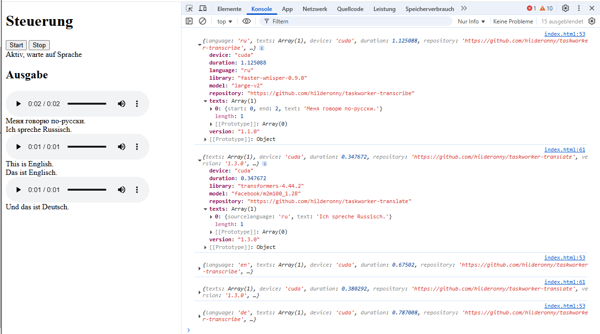

# web-live-transcription

Mit diesem Repository kann man Live-Transkriptionen im Browser machen.

## Installation

1. Dieses Repository klonen
2. [python-3.11.9.zip](python-3.11.9.zip) entpacken und den enthaltenen Unterordner in `./python` umbenennen
3. Python Bibliotheken installieren mit `python\python -m pip install faster-whisper==0.8.0 flask==3.1.1`
4. [cuBLAS.and.cuDNN_CUDA11_win_v4.7z](https://github.com/Purfview/whisper-standalone-win/releases/download/libs/cuBLAS.and.cuDNN_CUDA11_win_v4.7z) herunterladen und die enthaltenen DLLs nach `python/Lib/site-packages/ctranslate2` entpacken
5. [vc_redist.x64.exe](./vc_redist.x64.exe]) bei Bedarf installieren

## Betrieb

1. `python\python app.py` ausführen
2. http://localhost:5000 aufrufen

## WebVAD

Der erste Test läuft mit WebVAD und [TaskBridge](https://github.com/hilderonny/taskbridge).

Dazu wird eine [TaskBridge](https://github.com/hilderonny/taskbridge)-Instanz mit [Transcribe](https://github.com/hilderonny/taskworker-transcribe) und [Translate](https://github.com/hilderonny/taskworker-translate) Workern benötigt.

Dabei wird fortlaufend das Mikrofon aufgenommen und per [VAD](https://github.com/ricky0123/vad) Gesprochenes detektiert. Sobald ein Satz oder Absatz erkannt wurde, wird der Audioschnipsel transkribiert und der erkannte Text angezeigt.

Falls es sich bei der erkannten Sprache nicht um Deutsch handelt, wird der Text anschließend ins Deutsche übersetzt und die Übersetzung ebenfalls angezeigt.

Die URL zur TaskBridge wird in der Datei `./js/config.json` festgelegt.